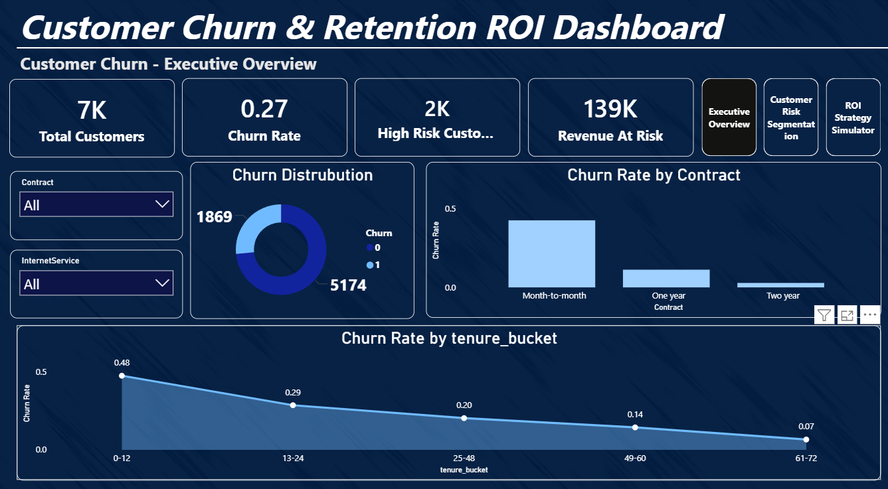
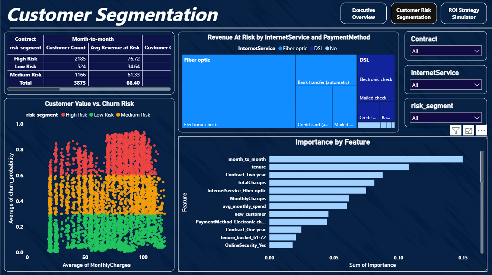
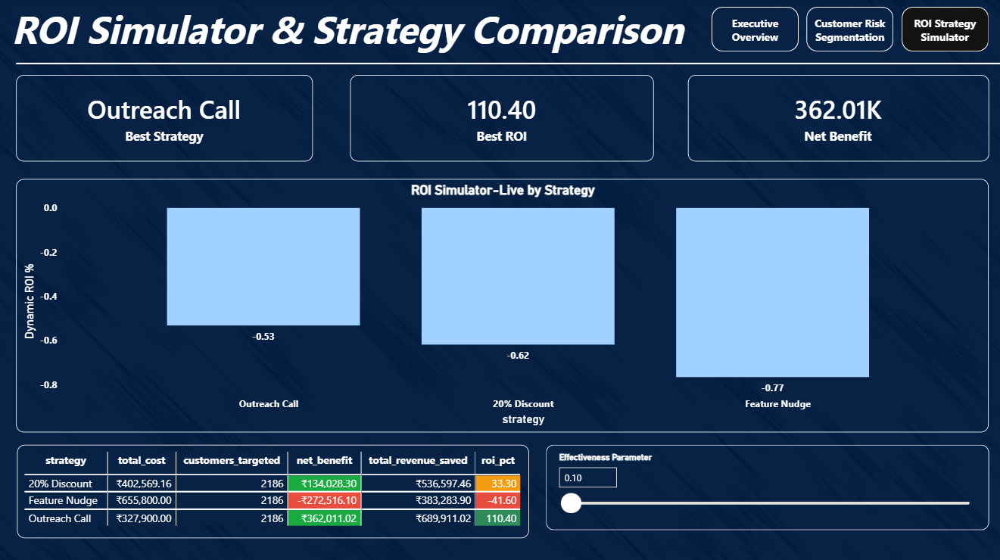

# Customer Churn Prediction & ROI Simulation

## Overview

This project is an end-to-end data analytics solution that predicts customer churn and evaluates customer retention strategies using Return on Investment (ROI) simulation. It combines machine learning, SQL analysis, and an interactive Power BI dashboard to help businesses identify high-risk customers and recommend the most cost-effective retention strategy.

The project is built using the IBM Telco Customer Churn dataset and follows a complete analytics workflow from data preprocessing to business decision support.

---

## Business Problem

Customer churn leads to significant revenue loss for subscription-based businesses. While predicting churn is valuable, businesses also need to determine which retention strategy provides the highest return on investment.

This project addresses both problems by:
- Predicting customers likely to churn.
- Segmenting customers by churn risk.
- Estimating revenue at risk.
- Comparing retention strategies using ROI analysis.

---

## Dataset

**Source:** [IBM Telco Customer Churn Dataset (Kaggle)](https://www.kaggle.com/datasets/blastchar/telco-customer-churn)

- ~7,043 customer records
- 21 original features
- Customer demographics
- Service subscriptions
- Billing information
- Customer churn status

---

## Project Workflow

### Data Preprocessing
- Data cleaning and missing value handling
- Data type conversion
- Exploratory Data Analysis (EDA)

### Feature Engineering
- Created business-driven features including:
  - New customer indicator
  - Number of subscribed services
  - Average monthly spending
  - High-value customer flag
  - Month-to-month contract indicator

### Machine Learning
- Random Forest Classifier for churn prediction
- Generated churn probability for every customer
- Segmented customers into:
  - Low Risk
  - Medium Risk
  - High Risk

### Revenue at Risk Analysis
- Estimated annual customer value
- Calculated expected revenue at risk
- Identified high-value customers requiring retention efforts

### ROI Simulation
Compared three retention strategies:

- Outreach Call
- 20% Discount
- Feature Nudge

For each strategy the following metrics were calculated:
- Total Cost
- Revenue Saved
- Net Benefit
- ROI %

### SQL Analysis
Performed business analysis using SQL including:
- Churn analysis by contract and tenure
- Revenue at risk by customer segment
- Customer segmentation
- Payment method analysis

### Power BI Dashboard
Developed a three-page interactive dashboard consisting of:

**Executive Overview**
- Customer KPIs
- Churn distribution
- Churn by contract
- Churn by tenure

**Customer Segmentation**
- Risk segmentation
- Revenue at risk analysis
- Customer value vs. churn probability
- Feature importance

**ROI Strategy Simulator**
- Strategy comparison
- ROI analysis
- Net benefit comparison
- Interactive effectiveness parameter

---

## Results

### Model Performance
- **Algorithm:** Random Forest Classifier
- **ROC-AUC:** 0.89
- **Precision (churn class):** 57%
- **Recall (churn class):** 83%
- **F1-Score (churn class):** 0.68
- **Overall accuracy:** 79%

Precision/recall are reported alongside accuracy because the dataset has a ~73/27 class imbalance — a model that always predicts "no churn" would score ~73% accuracy while being useless. The model is tuned to favor recall, catching more true churners at the cost of some false positives, which is the right tradeoff when the cost of missing a churner outweighs the cost of an unnecessary retention offer.

### Customer Risk Segmentation

| Segment | Customers | % of Base |
|---|---|---|
| Low Risk | 3,241 | 46.0% |
| Medium Risk | 1,616 | 22.9% |
| High Risk | 2,186 | 31.0% |

### Key Business Findings
- **Contract type is the strongest churn driver:** month-to-month customers churn at **42.7%**, versus 11.3% for one-year contracts and just 2.8% for two-year contracts.
- **Tenure drives risk sharply downward over time:** churn falls from **47.4%** in the first 12 months to just **6.6%** by months 61–72.
- **Payment method matters:** electronic check users churn at **45.3%**, nearly 3x the rate of automatic bank transfer (16.7%) or credit card (15.2%) customers.
- **High-risk customers are almost entirely month-to-month:** 99.95% of the High Risk segment is on a month-to-month contract, confirming contract type as the dominant risk factor.

### Revenue at Risk
- **Total annual revenue at risk (all customers):** ₹24,17,972
- **Revenue at risk from the High-Risk segment alone:** ₹15,33,136 (**63.4%** of total, from just 31% of customers) — a clear concentration effect that justifies prioritizing retention spend on this group.

### ROI Strategy Simulation (High-Risk segment, n = 2,186)

| Strategy | Total Cost | Revenue Saved | Net Benefit | ROI % |
|---|---|---|---|---|
| 20% Discount | ₹4,02,569 | ₹5,36,597 | ₹1,34,028 | 33.3% |
| **Outreach Call** | ₹3,27,900 | ₹6,89,911 | **₹3,62,011** | **110.4%** |
| Feature Nudge | ₹6,55,800 | ₹3,83,284 | -₹2,72,516 | -41.6% |

**Recommended strategy: Outreach Call.** It delivers the highest ROI (110.4%) and the largest net benefit (₹3,62,011) at the lowest cost of the three options tested. The Feature Nudge strategy actually loses money under these assumptions — its cost outweighs the revenue it saves — showing that the simulation stress-tests strategies rather than assuming every intervention pays off.

*Retention strategy costs and effectiveness assumptions (e.g. 45% churn-reduction for outreach calls) are modeling assumptions, not measured facts, and are documented as adjustable parameters in the ROI simulation notebook.*

---

## Tech Stack

- Python (Pandas, NumPy, Scikit-learn)
- SQL (MySQL / SQLite)
- Power BI, DAX
- Jupyter Notebook

---

## Dashboard Preview

### Executive Overview
Displays overall business KPIs including customer count, churn rate, high-risk customers, revenue at risk, churn distribution, contract analysis, and tenure-based churn trends.

### Customer Segmentation
Visualizes customer risk distribution, revenue at risk across services and payment methods, customer value versus churn probability, and machine learning feature importance.

### ROI Strategy Simulator
Compares retention strategies using ROI, net benefit, total cost, and revenue saved with an interactive effectiveness parameter for scenario analysis.

---

## Future Improvements

- Hyperparameter tuning for improved model performance
- Model comparison using XGBoost or LightGBM
- SHAP-based model explainability
- Streamlit web application for live predictions
- Deployment of the prediction pipeline

---

## Author

**Aman Kumar Singh**
B.Tech Computer Science Engineering
